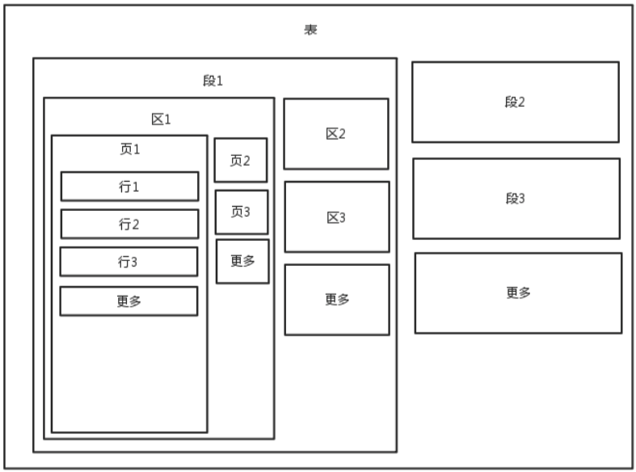

## 1.锁是什么

我们刚学习编程的时候，锁这个概念让你特别的抽象，锁在计算里面是用来控制共享资源并发访问的一种手段，有些资源在并发访问的时候你想串行执行就必须加锁控制，因为计算机的CPU是性能优先无序执行，所以只有通过加锁来让CPU按照你希望的顺序来执行。在Mysql中，我们希望用锁来保证我们数据的完整性和一致性，说具体点，就是我们电商系统中的库存，在高并发同一个产品库存时，为了避免被扣超出，我们需要数据库的锁机制来保证库存数据的完整性和一致行。

## 2.Mysql Innodb表空间

在了解Mysql Innodb锁之前，我们先来了解Mysql Innodb的表的存储方式。Mysql Innodb中的表都是索引表，索引表的意思就是他的数据存储是按照主键索引的顺序存书的，找到主键ID就找到了该行数据，就算没有显示设定主键，Innodb也会给你找个唯一列来作为主键索引，就算找不到也会给你自动生成一列，说完这个，我们来看看表数据是怎么存储的，看下图：

脑子里面要有这个结构，后学，我们说锁的类型的时候会联想到该图；

## 3.锁类型

一般我们说的锁类型一般就两种，读锁(S)和写锁(X)，但是如果算上加锁过程中，我们要对锁粒度的支持呢，还有读意向锁(IS-Intention S Lock)和写意向锁(IX-Intention X Lock)。他们的兼容性如下表：

|      |  IS  |  IX  |  S   |  X   |
| :--: | :--: | :--: | :--: | :--: |
|  IS  |  兼   |  兼   |  兼   |  不兼  |
|  IX  |  兼   |  兼   |  不兼  |  不兼  |
|  S   |  兼   |  不兼  |  兼   |  不兼  |
|  X   |  不兼  |  不兼  |  不兼  |  不兼  |

S锁：

实际例子，一个事务里面使用了select lock in share mode(S锁)，那么其他事务里面用lock in share mode可以获取数据，但是如果使用select from for update, delete, update, insert这些写锁操作相同资源都会被block，不兼容；

X锁：

实际例子，一个事务里面使用了select from for update(S锁), 那么其他事务里面使用select from for update, select lock in share mode, delete, update, insert这些写锁操作相同资源都会被block，所有都不兼容；

IS和IX锁：

这个其实算事一个过程锁，之前我们描绘了表的结构组成，是一层一层包到行级别的，如果我们对该表中一行上了一个行级X锁，那么innodb会从内到外，在页/区/段/表都加上IX锁。在innodb中，我们只有能操作到表锁和行级锁，不能操作页/区/段锁，这个还是举一个实际例子，一个事务使用了select for update锁住了A表的一行数据，这时给A表也套上了IX锁，如果另外一个事务正在执行alter的改表操作，该操作会导致给表加一个S锁，S锁和之前select for update套的IX锁是不兼容的，所以这个时候改表就会等待；

> TRX1:
>
> begin
>
> select * from test_id2 where id=1 for update
>
> commit
>
> 
>
> TRX2:
>
> ALTER TABLE test_id2 MODIFY refId bigint;

## 4.Snapshot read & Current read

待续